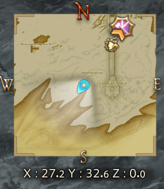

# Minimap Zoom


Dézoomez davantage sur la mini-carte de FFXIV et personnalisez sa forme, son fond, son cadre et ses marqueurs. Retrouvez vos réglages avec des profils et un raccourci de dézoom temporaire.



*Mini-carte carrée en jeu, version 0.4.1.*

## Installation et mises à jour

1. Dans les paramètres Dalamud (`/xlsettings`), ouvrir **Dépôts de plugins personnalisés**.
2. Ajouter cette URL, activer la ligne et enregistrer :

```text
https://raw.githubusercontent.com/Aleqsd/dalamud-plugins/main/repo.json
```

3. Dans `/xlplugins`, chercher **Minimap Zoom** et cliquer sur **Installer**.
4. Ouvrir `/minizoom` et sélectionner le zoom dans **Carte**.

Garder cette URL : Dalamud propose les mises à jour dès leur publication dans ce [catalogue personnalisé](https://github.com/Aleqsd/dalamud-plugins). Il est indépendant du catalogue officiel.

Si une copie de développement est déjà installée, la désactiver et retirer uniquement son entrée de **Dev Plugin Locations** avant l’installation normale. Conserver les fichiers de configuration et une seule copie chargée. Les [essais avec une DLL locale](docs/development.md#essais-avec-une-dll-locale) restent possibles pour le développement.

`/minizoom off` restaure l’affichage du jeu sans effacer vos profils. `/minizoom on` reprend le profil courant.

## Réglages

- **Carte** : zoom, forme, opacité du fond et cadre réglable. Masquez séparément boussole, coordonnées, soleil/lune, météo et boutons.
- **Marqueurs** : tailles, presets de filtres et réduction des icônes secondaires trop proches. Votre personnage reste visible.
- **Profils** : conservez plusieurs vues et associez-les aux zones de votre choix. Le profil Personnel reprend vos anciens réglages.
- **Utilisation** : raccourci maintenu, démarrage et restauration. Le raccourci et les profils automatiques sont facultatifs.

**Version expérimentale 0.5.0**, pour Dalamud API 15 et le client `2026.08.11.0000.0000`. La portée suit le dézoom, avec la limite native de 100 marqueurs et des données disponibles côté client. Les nouveaux effets de cette version sont vérifiés hors jeu et restent à confirmer dans FFXIV.

[Compiler et vérifier](docs/development.md) · [Validation](docs/validation.md) · [Historique](CHANGELOG.md)
