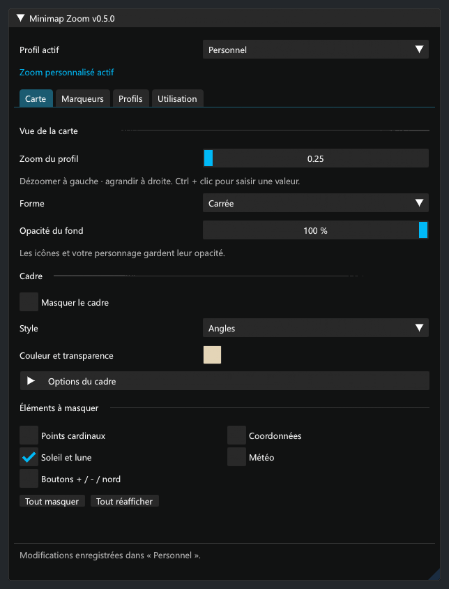

# Minimap Zoom


Dézoomez davantage sur la mini-carte de FFXIV, choisissez une forme carrée et personnalisez son cadre. Masquez les marqueurs, le soleil/la lune, la météo ou les boutons, et réglez la taille des icônes.



*Panneau réel du plugin rendu avec ImGui hors jeu, police Segoe UI. Le rendu natif de la mini-carte reste à tester en jeu.*

## Installation et mises à jour

1. Dans les paramètres Dalamud (`/xlsettings`), ouvrir **Dépôts de plugins personnalisés**.
2. Ajouter cette URL, activer la ligne et enregistrer :

```text
https://raw.githubusercontent.com/Aleqsd/dalamud-plugins/main/repo.json
```

3. Dans `/xlplugins`, chercher **Minimap Zoom** et cliquer sur **Installer**.
4. Ouvrir `/minizoom` et sélectionner le zoom dans **Carte**.

Garder cette URL : Dalamud propose les mises à jour dès leur publication dans ce [catalogue personnalisé](https://github.com/Aleqsd/dalamud-plugins). Il est indépendant du catalogue officiel.

Si une copie de développement est déjà installée, la désactiver et retirer uniquement son entrée de **Dev Plugin Locations** avant l’installation normale. Conserver les fichiers de configuration et une seule copie chargée. Les [essais avec une DLL locale](docs/development.md#essais-avec-une-dll-locale) restent possibles pour le développement.

`/minizoom off` restaure la mini-carte. Le zoom automatique se choisit dans **Démarrage**.

## Réglages

- **Carte** : zoom de 0,25 à 2, forme, cadre ; masquage indépendant du soleil/de la lune, de la météo et des boutons (+, − et verrouillage du nord).
- **Marqueurs** : tailles séparées, masquage global ou par catégorie. Votre personnage reste visible.
- **Démarrage** : réactivation du zoom et ouverture des réglages en option.

**Version expérimentale 0.4.1**, pour Dalamud API 15 et le client `2026.08.11.0000.0000`. La portée des icônes fixes suit le dézoom ; la limite native de 100 marqueurs et les données disponibles côté client restent applicables. Les réglages gardent une présentation fixe qui suit l’échelle globale Dalamud. Les préférences de la mini-carte sont conservées lors de la mise à jour.

[Compiler et vérifier](docs/development.md) · [Validation](docs/validation.md) · [Historique](CHANGELOG.md)
