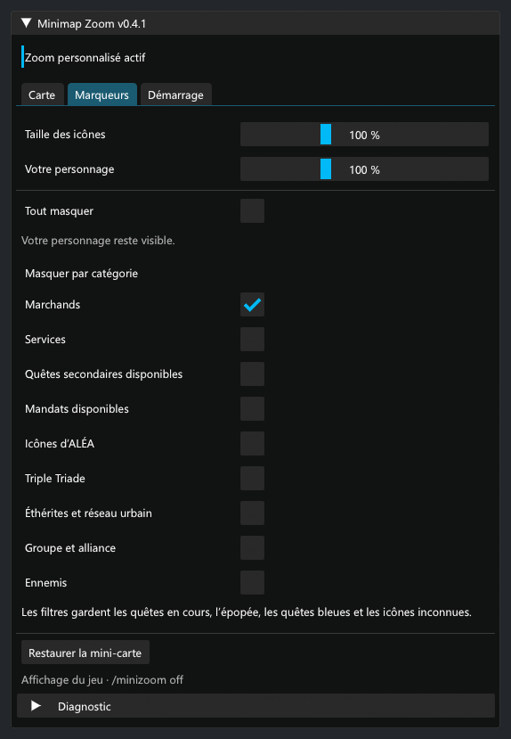

# Validation de 0.4.1

- Compilation Release avec le SDK .NET 10 et Dalamud API 15 : aucune erreur ni avertissement.
- 54 contrôles hors jeu : structures natives, cinq signatures uniques dans le client pris en charge, zoom et restauration, portée des marqueurs, masquage, textures privées, tailles, filtres et migrations.
- Les nouveaux contrôles couvrent les huit combinaisons météo/boutons/soleil, les images et collisions enfants, les composants imbriqués, les mises à jour natives répétées et la restauration des états de visibilité, de zoom et du nord verrouillé.
- Panneau réel ImGui rendu à 100 %, 150 % et 200 %, à largeur normale et à largeur 360 ; fenêtre minimale 360 × 320 avec défilement. Inspection des vues Carte, Marqueurs, Démarrage, du masquage global, de l’attente et de l’incompatibilité.
- Événements souris ImGui : météo, boutons, soleil/lune, cadre, curseur de zoom, navigation, masquage global, catégorie désactivée puis réactivée, défilement jusqu’aux commandes de restauration.
- Une configuration 0.4.0 avec thème, police, couleurs, opacité et offsets personnalisés produit exactement les mêmes pixels que le défaut. Les préférences natives sont conservées et les anciens champs de style ne sont plus enregistrés. Changer le style et la couleur du cadre ne modifie pas le thème du panneau.

*Rendu ImGui hors jeu, Segoe UI et données fictives. La fenêtre en jeu utilise la police active de Dalamud.*

## Ce qui reste à confirmer en jeu

Le dézoom initial a été confirmé par l’utilisateur. Les correctifs de portée, les masquages et la fenêtre ont été contrôlés hors jeu ; leur résultat natif nécessite un essai dans FFXIV. Une compilation ou un chargement réussi ne vaut pas validation du rendu.

Dans `/minizoom`, essayer le zoom 0,25 près d’icônes fixes éloignées, puis masquer/réafficher des catégories, le soleil/la lune, la météo et les boutons. Les zones de clic et infobulles des contrôles masqués doivent disparaître puis revenir à la restauration. Vérifier aussi les boutons en mode nord verrouillé, la molette avec les boutons masqués, un changement de météo/zone et le rechargement. `/minizoom off` doit restaurer les éléments de la mini-carte.

Le compteur « Portée étendue » de Diagnostic doit augmenter avec le zoom étendu actif. Vérifier déplacement, flèches de bordure, rotation et éditeur ATH. Les quêtes en cours, l’épopée, les quêtes bleues et les icônes inconnues sont conservées par les filtres sélectifs. Le masquage global retire tous les marqueurs réguliers, y compris leurs surfaces ; le repère du personnage reste visible. Des icônes peuvent encore manquer si les données ne sont pas disponibles ou si les 100 emplacements natifs sont occupés.
