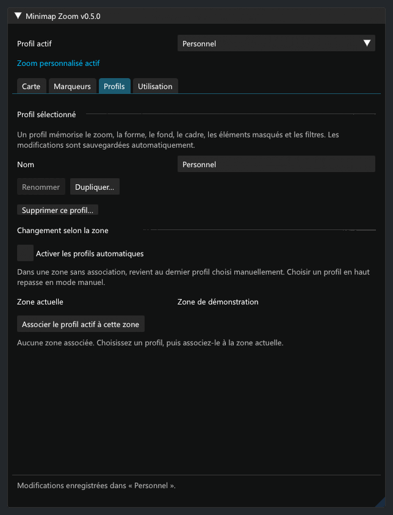

# Validation

## 0.5.1 — client du 1er septembre, vérifié le 8 septembre 2026

- Compilation Release avec .NET 10 et Dalamud 15.0.3.3 : aucune erreur ni avertissement.
- 70 contrôles hors jeu réussis, dont le couple version/empreinte du nouveau client, les cinq signatures uniques à leurs nouvelles adresses, les offsets et la restauration. Les versions inconnues et empreintes inattendues restent refusées.
- Comparaison statique des fonctions de zoom/portée et du WidgetData complet de la mini-carte : voir [le relevé de compatibilité](compatibility-20260901.md).
- 36 scénarios ImGui générés et contrôlés, dont six diagnostics d’incompatibilité inspectés aux tailles normale/minimale et à 100 %, 150 % et 200 %. Client détecté et client pris en charge sont distincts ; texte et pied de fenêtre restent lisibles.
- Profils, zoom et apparence sauvegardés inchangés. Aucun essai de ce binaire dans FFXIV n’est revendiqué. Reprendre le parcours ci-dessous avec **0.5.1** sur le nouveau client ; vérifier particulièrement le chargement, le dézoom, les marqueurs et la restauration au déchargement.

## Référence 0.5.0 — ancien client

- Compilation Release, .NET 10 et Dalamud API 15 : aucune erreur ni avertissement.
- 68 contrôles hors jeu : contrats et offsets natifs, empreinte du client et cinq signatures uniques, zoom, portée, restauration, textures privées, filtres et migrations.
- Nouveaux essais : masquage indépendant de la boussole et des coordonnées, opacité sans effet sur les icônes ou le RGB, absence de multiplication répétée, conservation d’un alpha natif plus récent et restauration.
- Profils : migration depuis 0.4.1, duplication indépendante, renommage, choix automatique par zone, retour au choix manuel, suppression des seules associations concernées, valeurs invalides et rechargement avec System.Text.Json et Newtonsoft.Json.
- Raccourci : machine d’état testée à l’appui et au relâchement, perte de contexte, annulation et nécessité d’un nouvel appui. Les coefficients temporaires restent séparés des préférences. Les touches réellement reçues dans FFXIV ne sont pas simulées par ces essais.
- Réduction d’encombrement : seules les icônes secondaires reconnues et proches sont réduites, au zoom étendu ; les positions et repères protégés restent identiques. Les tailles et textures de cadres se restaurent sans fuite dans les fixtures.
- 31 scénarios du panneau réel ImGui : Carte, Marqueurs, Profils et Utilisation à 100 %, 150 % et 200 %, fenêtre normale 620 × 820 et minimale 380 × 360, libellés longs, attente, incompatibilité, restauration et filtres désactivés. Défilement du contenu avec profil/navigation fixes ; aucune barre horizontale.
- Événements souris et clavier ImGui : navigation, cadre et dimensions, cinq décorations, opacité, zoom, filtre global et catégorie désactivée/réactivée, saisie du nom « Profil été », duplication, association de zone, profils automatiques, raccourci et restauration.
- Ancienne configuration de style : rendu identique pixel par pixel. Changer la couleur ou le style du cadre laisse les réglages visuellement stables.

*Rendus ImGui hors jeu, Segoe UI et données fictives. En jeu, les réglages utilisent la police active de Dalamud.*

## Essai restant dans FFXIV

L’utilisateur a confirmé le fonctionnement du dézoom et fourni la capture en jeu de la version 0.4.1. Cette confirmation ne couvre pas le nouveau binaire 0.5.0. Les effets natifs, les clics du jeu, le cycle de chargement et le raccourci doivent encore être essayés dans FFXIV.

1. Charger une seule copie de 0.5.0 et vérifier version/chemin dans Utilisation → Diagnostic. Vérifier que Personnel reprend les anciens réglages.
2. Masquer puis réafficher boussole, coordonnées, soleil/lune, météo et boutons. En rond comme en carré, les autres éléments et le personnage doivent rester indépendants.
3. Régler l’opacité du fond à 0 %, 40 % et 100 %. Vérifier les icônes, la rotation/nord verrouillé, un changement de zone et la restauration.
4. Modifier l’épaisseur et les angles du cadre. Vérifier déplacement et échelle dans l’éditeur ATH, puis désactivation/rechargement.
5. Dupliquer un profil, modifier son zoom et ses filtres, associer deux zones et activer l’automatisme. Quitter une zone associée doit rétablir le dernier profil manuel ; un choix manuel doit suspendre l’automatisme.
6. Activer un raccourci libre, le maintenir puis le relâcher. Vérifier aussi avec le zoom du jeu actif, pendant la saisie dans le chat ou ImGui, après changement de zone, perte de focus et fermeture de l’addon. Le zoom enregistré dans le profil doit rester intact.
7. Comparer les icônes secondaires regroupées à 0,25 avec/sans réduction, puis à 0,50. Les positions, le joueur, les objectifs protégés et les surfaces restent identiques. La réduction n’élimine pas une superposition exacte.
8. Restaurer toute la mini-carte puis recharger : affichage du jeu conservé et profils encore enregistrés. Reprendre le profil doit réappliquer ses préférences.

La capacité native reste de 100 marqueurs. Des icônes peuvent manquer faute de données côté client ou de place ; le compteur de portée ne prouve pas à lui seul leur rendu. L’élargissement de collecte et l’absence de garde PvP restent les limites décrites dans la préparation de soumission officielle ; cette release ne constitue pas une approbation du catalogue officiel.
