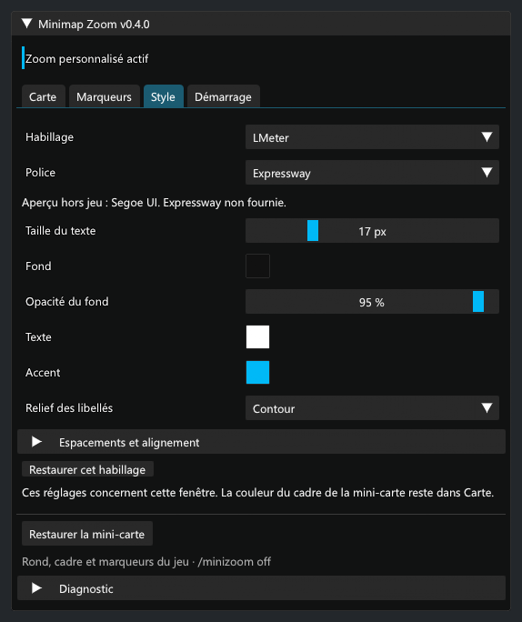

# Validation de 0.4.0

- Compilation Release avec le SDK .NET 10 et Dalamud API 15 : aucune erreur ni avertissement.
- 52 contrôles hors jeu : structures natives, cinq signatures uniques dans le client pris en charge, zoom et restauration, rayon des marqueurs, masquage des enfants et mises à jour tardives, soleil/lune, textures privées, tailles, filtres et migrations.
- Panneau réel ImGui rendu à 100 %, 150 % et 200 %, à largeur normale et à largeur 360 ; fenêtre minimale 360 × 320 avec défilement. Inspection des vues Carte, Marqueurs, Style, Démarrage, du masquage global, d’Obsidienne, de l’attente et de l’incompatibilité.
- Événements souris ImGui : soleil/lune, cadre, curseur de zoom, navigation, masquage global, catégorie désactivée puis réactivée, défilement jusqu’aux commandes de restauration.

*Rendu ImGui hors jeu, Segoe UI et données fictives.*

## Ce qui reste à confirmer en jeu

Le dézoom initial a été confirmé par l’utilisateur. Les correctifs de portée et de masquage et la nouvelle fenêtre ont été contrôlés hors jeu ; leur résultat visuel et le cycle de polices géré par Dalamud nécessitent un essai dans FFXIV. Une compilation ou un chargement réussi ne vaut pas validation du rendu.

Dans `/minizoom`, essayer le zoom 0,25 près d’icônes fixes éloignées, puis masquer/réafficher des catégories et le soleil/la lune. Le compteur « Portée étendue » de Diagnostic doit augmenter avec le zoom étendu actif. Vérifier le déplacement, les flèches de bordure, les clics et infobulles, le changement de zone, la rotation/nord verrouillé, l’éditeur ATH et le rechargement. `/minizoom off` doit restaurer le rond, le cadre et les marqueurs sans effacer le style de la fenêtre.

Les quêtes en cours, l’épopée, les quêtes bleues et les icônes inconnues sont conservées par les filtres sélectifs. Le masquage global retire tous les marqueurs réguliers, y compris leurs surfaces ; le repère du personnage reste visible. Des icônes peuvent encore manquer si les données ne sont pas disponibles ou si les 100 emplacements natifs sont occupés.
